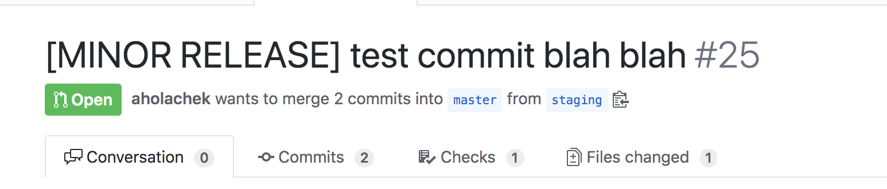

## Workflows that are currently work(flow)ing
1. Backmerge `edge` and `staging` branches after successful merge to `master`
2. Automate release bump (patch is default, can also specify "major" and "minor" in commit message) by committing a release to any prs made to master.
3. Run tests for prs & cache `node_modules` between builds

## How to test
1.  Fork repo
2.  Checkout staging locally and commit some changes
3.  Make a pr from staging ==> master on github
4.  In github interface for the PR, rename commit to something like [MASTER RELEASE] or [MINOR RELEASE] (the default release on merge will be a patch otherwise):

5. You should see a release version commit added to the list of commits for the pr.
6.  Once the tests pass, merge the pr into master
7.  Navigate to the workflow actions tag to see the release + backmerge into staging and edge in progress.
8. Confirm that edge, staging and master all have the new release commmit.

## Helpful resources

1. [action to run node script](https://github.com/actions/setup-node)
2. [action to push branch back to repo](https://github.com/ad-m/github-push-action)
3. [caching](https://help.github.com/en/actions/automating-your-workflow-with-github-actions/caching-dependencies-to-speed-up-workflows#using-the-cache-action)
4. [caching examples](https://github.com/actions/cache/blob/master/examples.md#node---yarn)
5. [workflow triggers](https://help.github.com/en/actions/automating-your-workflow-with-github-actions/events-that-trigger-workflows)
